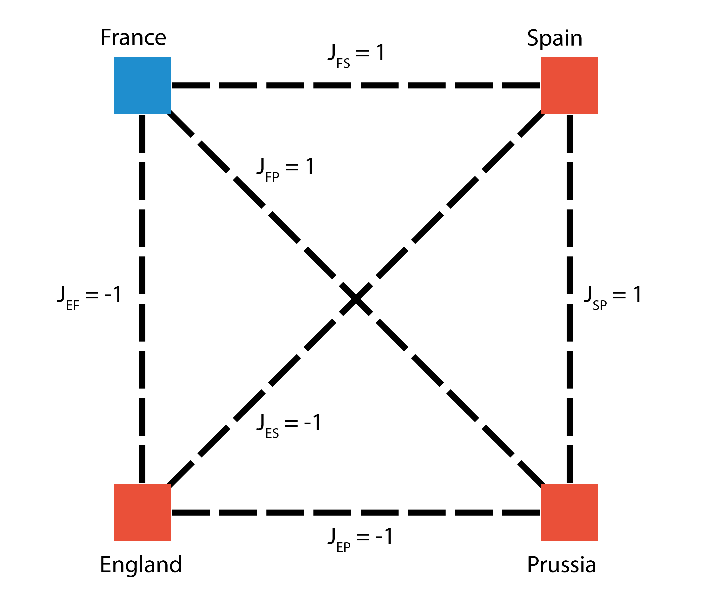

The current simulation consists of four actors (England, France, Spain, Prussia).
England takes the roll of the pariah with negative propensities (-1) connecting it to the other actors.
The other actors all have positive propensities (+1) with one another and a negative one (-1) with England.

### Note on the visualisations
The system is visualised in the simulation as four coloured squares which represent England, France, Spain and Prussia (in that order):

Blue equals a spin of -1 while Red equals a spin of +1.

<a href="about/more_information">about the simulation</a>

<a href="DegeneracyData/Total/GainHist.html">Total Gain Histogram</a>

<a href="DegeneracyData/Individual/IndividualGainHist.html">Individual Gain Histogram</a>

<a href="EvolutionData/Evolution.html">Evolution of the system</a>

<a href="TreeData/Tree.html">Decision Tree</a>
